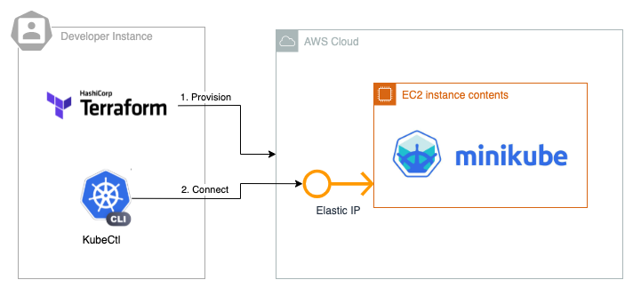

# EC2-Minikube

## Architecture



## Usage

### Set up the aws Cli

Use your access key and secret access key to authenticate

```bash
aws configure
```

### Add execution permission on "downoad_kubeconfig" script

```bash
sudo chmod +x ./scripts/download_kubeconfig.sh
```

### Install yq , yaml template engine .

```bash
sudo add-apt-repository ppa:rmescandon/yq
sudo apt-get install yq
```

### Check your provisioning plan

```bash
terraform plan
```

### Provisioning the Infrastructure

```bash
terraform apply
```

### Connecting to the k8s cluster "check output"

You can export the Kubeconfig file using this helper

```bash
$(terraform output -raw kubeconfig_command)
```

### Checking the connection

```bash
kubectl cluster-info
```

### You can validate and check your Iac with TFlint

```bash
make verify
```
